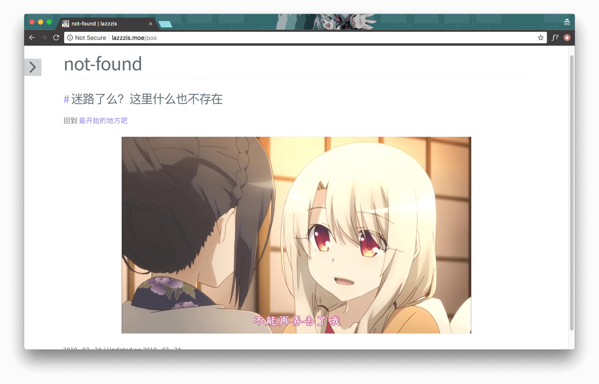

# 自定义 404 页面

新建一篇文章，可以起任意名字，比如 `404`, `not-found` 之类的。举个例子:

```bash
$ hexo new "not-found"
```

可以看到系统提示 `not-found.md` 被创建了。复制文件名（不包含后缀名），在主题的配置文件 `_config.yml` 中创建新字段 `Page404: not-found`。

404 页面的内容将会以一片文章的形式展现，因此你在 `not-found` 里编辑的内容就是 404 页面展现的内容。比如


```
---
title: not-found
date: 2018-03-24 14:31:52
comments: false
---

### 迷路了么？这里什么也不存在

回到 [最开始的地方吧](/)


```

> `comments: false` 可以用于取消对 404 页面的注释，推荐加上这一字段。

渲染后的样子


