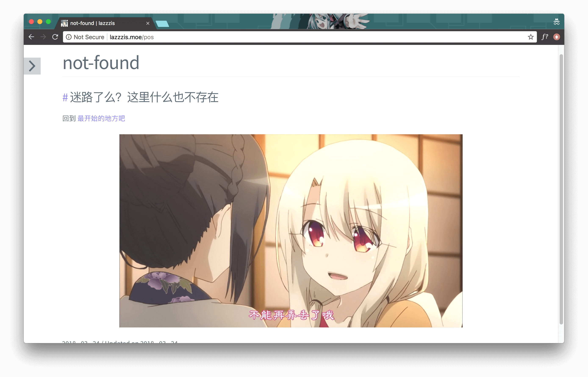

# Customize 404 Page

Create a new post, which you can name anything, like `404`, `not-found`. An example:

```bash
$ hexo new "not-found"
```

The terminal would prompt that `not-found.md` is created. Copy the filename (without `.md` extension), and then insert a new record on the config file `_config.yml` of the theme:

```yml
Page404: not-found
```

The 404 page will show like a post. Therefore, the content of the `not-found.md` is just the content of your 404 page, such as

```
---
title: not-found
date: 2018-03-24 14:31:52
comments: false
---

### 迷路了么？这里什么也不存在

回到 [最开始的地方吧](/)


```

> `comments: false` is recommended, since this can disable commenting on the 404 page

will be rendered as:


