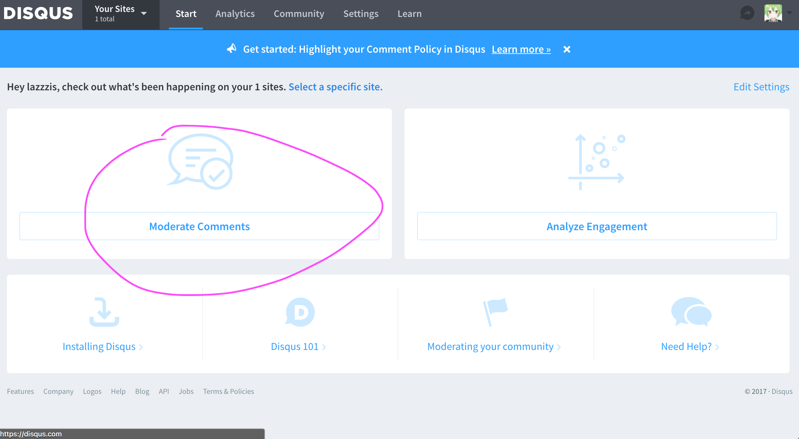
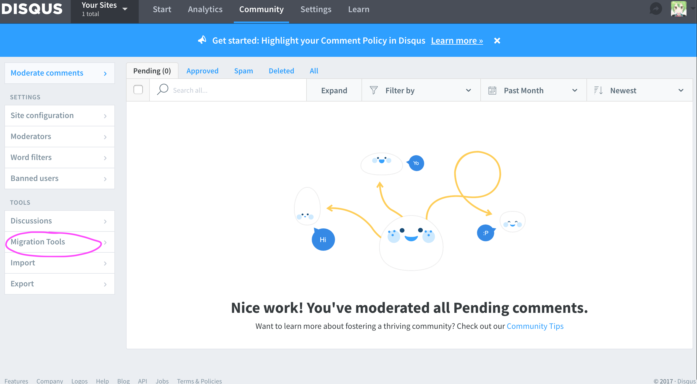
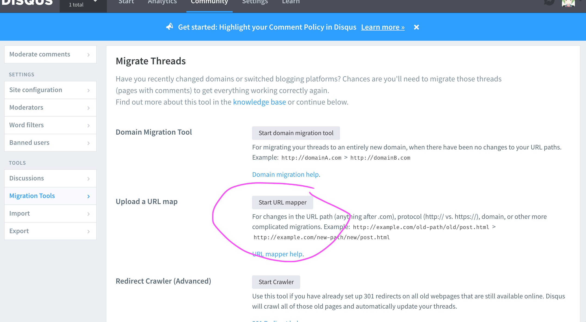
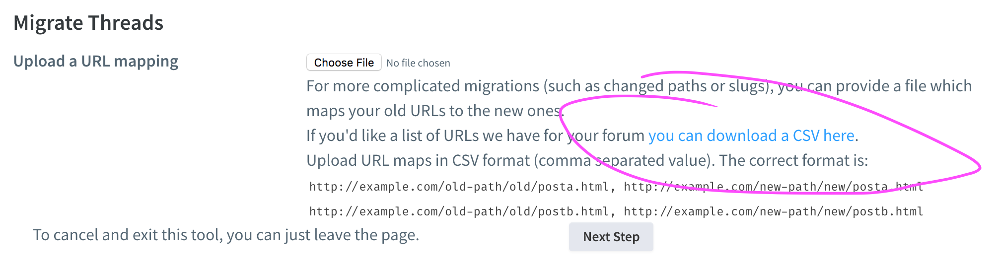
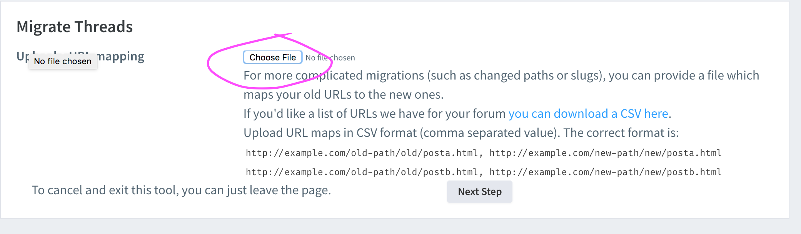

# Comment Migration

Due to some reason, all links to the posts are changed to `/post/:title`, which is different from the default url format.

Take `https://lazzzis.github.io/2017/12/25/xmas` as an example, under the constraint of this theme, the link is changed to `https://lazzzis.github.io/post/xmas`. As a result, if you choose `disqus` as your comment system, you have to migrate your comments.

**Note**:

In disqus, `https://lazzzis.github.io/about` differs from `https://lazzzis.github.io/about/`. For standardizing, all links to comment is ended with slash `/`, just like the latter.

If you're unclear how to migrate, follow these steps:

Log in [disqus](https://disqus.com), and then click `Admin`.

Click `moderate comments`:



Click `migration tools` on the left sidebar:



Choose the site, and then click `Url Mapper` (Click for `URL mapper help` for further information)



Click `Download`:




Your inbox, which you used to register account, would receive an email containing a link to download a file. It is a csv file, containing all the urls of your blog.

Each line indicates a match rule: original urls on the left while new urls on the right, separated by a comma, such as

```csv
https://lazzzis.github.io/2017/03/05/source-code-of-howdoi/, https://lazzzis.github.io/post/source-code-of-howdoi/
```

You can delete any url which you don't want it to match a new url.

For example: these are links of my origin blogs:

```csv
https://lazzzis.github.io/about
https://lazzzis.github.io/blogs/testsfd/
https://lazzzis.github.io/2017/03/25/recent-interviews-in-march-2017/
```

I don't want to update the first one and second one, so I only need to update the third one and fourth one. After modifying, the links are like following:

```csv
https://lazzzis.github.io/2017/03/25/recent-interviews-in-march-2017/, https://lazzzis.github.io/post/recent-interviews-in-march-2017/
```

> P.S. A scripts, utilizing regular expressions, could help you a lot.

After updating this file, open the site which you download this file and then upload the modified file.



After uploading, it would take several minutes to one day to migrate all the comments.
