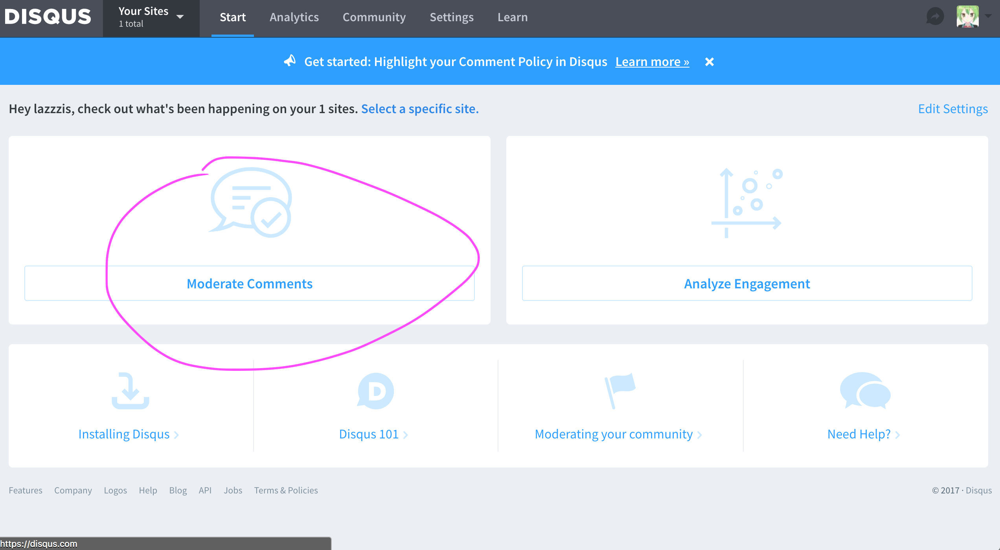
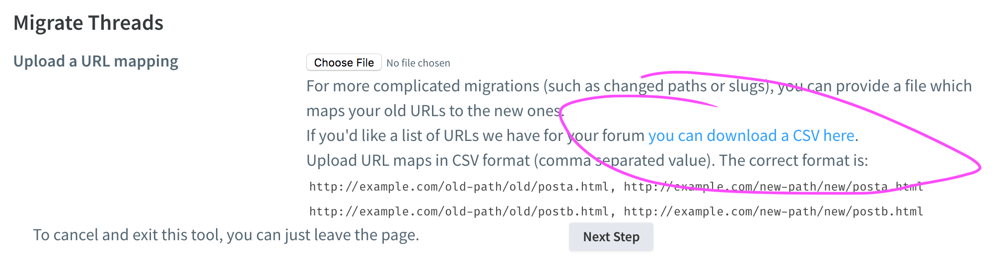
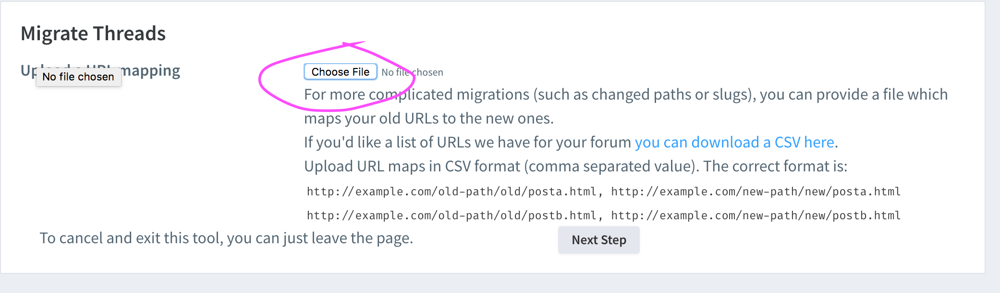

# 评论迁移

因为某些原因，这里的博客文章的链接统一变为了 `/post/:title` 显示，而 hexo 默认却不是这样的。

比如以前我一篇文章的地址是 `https://lazzzis.github.io/2017/12/25/xmas`，但在这个主题的限制下，这篇文章对应的链接变成了 `https://lazzzis.github.io/post/xmas`。如果你用 disqus 评论的系统的话，这意味着你必须迁移评论。

如果你不知道怎么迁移，可以按照如下步骤:

登录 [disqus](https://disqus.com)，选择右上角的 Admin

选择 moderate comments:



选择左栏的 migration tools:


选择站点后，选择 Url Mapper (可以点击 URL mapper help 顺便查看匹配的具体信息):


选择下载:



之后会在你的注册 disqus 的邮箱里收到一封邮件，里面有个链接指向下载，下载后会有一个 csv 文件，里面是你的博客中所有评论对应的 url。

每一行写一个匹配规则，匹配规则为，左边写原 URL，右边写新的 URL，中间用一个逗号分隔，比如:

```csv
https://lazzzis.github.io/2017/03/05/source-code-of-howdoi/, https://lazzzis.github.io/post/source-code-of-howdoi/
```

并不是里面所有的 URL 都有对应的匹配规则，比如你不想改的那一行的路由 ，直接删除就行了。

比如这是我之前的全部路由:

```csv
https://lazzzis.github.io/about
https://lazzzis.github.io/blogs/testsfd/
https://lazzzis.github.io/2017/03/25/recent-interviews-in-march-2017/
```

其中前两个不要，只要第 3 个，所以更改后只有:

```csv
https://lazzzis.github.io/2017/03/25/recent-interviews-in-march-2017/, https://lazzzis.github.io/post/recent-interviews-in-march-2017/
```

> P.S. 如果你需要改的较多，建议写一个脚本，利用正则表达式匹配

更改完后，保存文件，回到之前下载文件的地方，点击上传这个 csv 文件即可。



上传后过一段时间（快则几分钟，慢则一天）即可生效。
